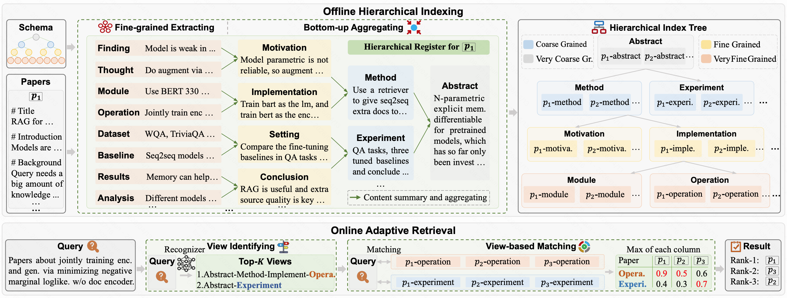

# PaperRegister

PaperRegister: Boosting Flexible-grained Paper Search via Hierarchical Register Indexing (ACL 2026)

https://arxiv.org/abs/2508.11116

---

As researchers delve more deeply into their work, paper search requirements may become more flexible, sometimes involving specific details such as module configuration rather than being limited to coarse-grained topics. However, previous paper search systems are unable to meet these flexible-grained requirements, as previous systems mainly collect paper abstract to construct corpus index, which lacks detailed information to support retrieval by some finer-grained queries. In this work, we propose PaperRegister, which transforms traditional abstract-based index into a hierarchical index tree, thereby supporting queries at flexible granularity. Experiments on paper search tasks across a range of granularity demonstrate that PaperRegister achieves the SOTA performance, and particularly excels in the fine-grained scenarios, highlighting good potential as an effective solution for flexible-grained paper search in real-world applications.




### Prepare Environment and Data
```bash
pip install -r requirements.txt

mkdir registration && cd ./registration


download raw_papers.json from https://drive.google.com/file/d/1BvNyQoDeo16ezm7Kzj-bcqIYw-LhzOzX/view?usp=drive_link 
```

### Offline Hierarchical Indexing

``` bash
# fine-grained extracting
bash regist_step1_extract.sh # extraction output will be saved in ./registration/registration_step1.jsonl

# bottom-up aggregrating
bash regist_step2_transform.sh # extraction output will be saved in ./registration/registration_step2.jsonl

# get the hierarchical index tree
python offline.py # indexing output will be saved in ./registration/db

```

### Online Adaptive Retrieval

``` bash
# view identifying
python plus_router_get_tree.py # prepare constrained decoding for view recognizer, will be saved in ./utils/plus_tree.json
bash plus_router_inference.sh # run view recognizer for all queries, output will be saved in ./result

# view-based matching
python plus_online.py # the paper search results will be saved in ./result

# get scores
python plus_get_score.py
```

### View Recognizer Training
``` bash
# sft
bash plus_router_train_sft.sh # training data is ./data_train/plus_datas_train.jsonl_aug.jsonl

# hierarchical-reward grpo
bash plus_router_train_grpo.sh # training data is ./data_train/plus_datas_train.jsonl_aug.jsonl_grpo.jsonl
```
